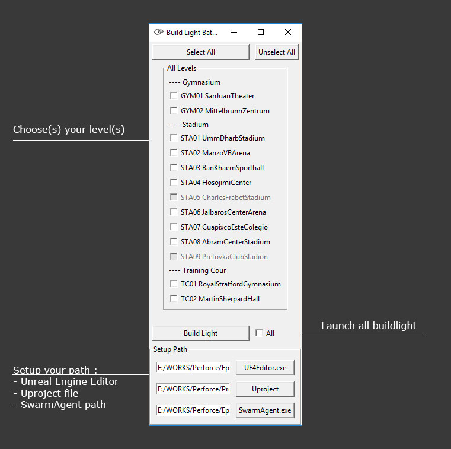

# BatchBuildLightUE4
[Python] [PyQt5] [UE4] [GameArt] [GameDev]

## Summary
Python tools [GUI] to automatize your *build light* process on UE4 project. This tools are in dev, it's functional but only for my project, a huge refactoring are needed to work for all project.

# Dependence
This tool use Python 3.6 and work with any package, more information are 
avaible with the *requierment.txt*. Quickly, see this list :
 - PyQt5
 - python-perforce
 - psutil
 - ifaddr
 

# How to use
First step, you need to setup all path, you can find it on the Menu Bar 
*"Setup"*, when you have finished, youcan see your levels appeared on your 
main windows. Now, select your level(s) and click built-it.

 You can select the checkbox "All" to force your Swarm Agent to use more machine.

 !! Don't forget to disable your hibernate option from Windows !!

## Batch File
### Launch
This .bat launch the program.

### Update
Use this .bat to download the latest git version.

### Packages
Install all python dependence.